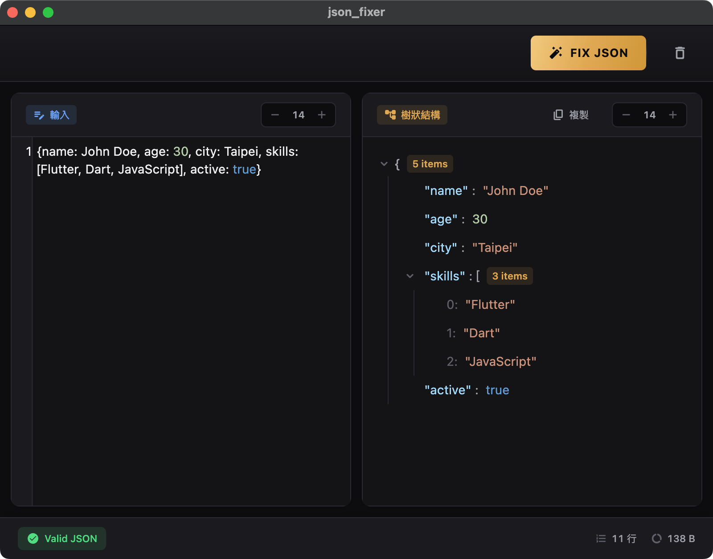
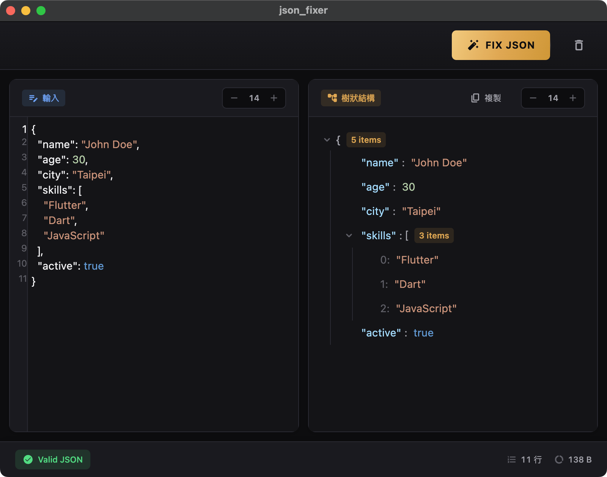

# 🔧 JSON Fixer

<div align="center">



**A powerful macOS desktop application for fixing and formatting non-standard JSON**

[](https://flutter.dev/)
[](https://dart.dev/)
[](https://www.apple.com/macos/)
[](LICENSE)

</div>

## 🎯 Why JSON Fixer?

When developing Flutter applications with Dio package, backend JSON responses often lose their double quotes in console logs, becoming Dart Map-like format:

```dart
// ❌ What you see in console logs
{name: John, age: 25, active: true}

// ✅ What you need for JSON tools
{"name": "John", "age": 25, "active": true}
```

This format cannot be directly pasted into JSON tools and is difficult to read for complex nested structures. **JSON Fixer** solves this pain point by automatically converting console logs into standard JSON format.

## ✨ Features

### 🔄 Smart JSON Repair
- **Dart Map Format** → Standard JSON
- **Single Quotes** → Double Quotes  
- **Unquoted Keys** → Properly Quoted
- **Missing Brackets** → Auto-completion
- **Trailing Commas** → Automatic removal

### 🌳 Tree View Visualization
- Hierarchical JSON structure display
- Expandable/collapsible nodes
- Syntax highlighting with type identification
- Click-to-copy values

### 📊 Real-time Statistics
- Line count and file size
- JSON validation status
- Error messages with helpful hints

### 🎨 Modern UI/UX
- Dark theme optimized for developers
- Adjustable font sizes
- Split-pane editor layout
- Responsive design

## 🖼️ Screenshots

### Before: Raw Console Log Format

*Raw Dart Map format from console logs - difficult to read and use*

### After: Clean JSON Format

*Properly formatted JSON with syntax highlighting and tree view*

### Key Features Demonstrated

✅ **Smart JSON Repair**: Automatically converts Dart Map format to standard JSON  
✅ **Syntax Highlighting**: Color-coded JSON elements for better readability  
✅ **Tree View**: Hierarchical structure display with expand/collapse functionality  
✅ **Real-time Validation**: Instant feedback on JSON validity  
✅ **Statistics Display**: Line count, file size, and structure information  
✅ **Modern UI**: Dark theme optimized for developers

## 🚀 Quick Start

### Prerequisites
- macOS 10.15 or later
- Flutter SDK 3.10.0+
- Xcode (for macOS development)

### Installation

1. **Clone the repository**
   ```bash
   git clone https://github.com/yourusername/json_fixer.git
   cd json_fixer
   ```

2. **Install dependencies**
   ```bash
   flutter pub get
   ```

3. **Run the application**
   ```bash
   flutter run -d macos
   ```

### Building for Release

```bash
# Build release version
flutter build macos --release

# The app will be available at:
# build/macos/Build/Products/Release/json_fixer.app
```

## 💡 Usage Examples

### 🔄 Transformation Examples

#### Example 1: Dart Map Format → Standard JSON
```diff
- {name: John Doe, age: 30, skills: [Flutter, Dart, JavaScript], active: true}
+ {
+   "name": "John Doe",
+   "age": 30,
+   "skills": ["Flutter", "Dart", "JavaScript"],
+   "active": true
+ }
```

#### Example 2: Single Quotes → Double Quotes
```diff
- {'user': {'name': 'Alice', 'email': 'alice@example.com'}}
+ {
+   "user": {
+     "name": "Alice",
+     "email": "alice@example.com"
+   }
+ }
```

#### Example 3: Mixed Format → Clean JSON
```diff
- {id: 123, user: {name: John, active: true}, tags: [mobile, web]}
+ {
+   "id": 123,
+   "user": {
+     "name": "John",
+     "active": true
+   },
+   "tags": ["mobile", "web"]
+ }
```

## 🏗️ Project Architecture

```
lib/
├── main.dart                 # Application entry point
├── app.dart                  # MaterialApp configuration
├── core/
│   └── theme/               # Global theme system
│       ├── app_colors.dart
│       ├── app_theme.dart
│       └── ...
├── shared/
│   └── widgets/             # Reusable components
└── features/
    └── json_editor/
        ├── domain/
        │   └── models/      # Data models
        ├── presentation/    # UI layer (pages & widgets)
        │   ├── pages/
        │   └── widgets/
        │       ├── editor/
        │       ├── toolbar/
        │       ├── tree_view/
        │       └── status_bar/
        ├── providers/       # Riverpod state management
        └── services/        # Business logic (JSON fixing core)
```

## 🛠️ Technical Stack

- **Framework:** Flutter 3.10.0
- **Language:** Dart 3.7.0
- **State Management:** Riverpod 3.x
- **Code Editor:** re_editor with syntax highlighting
- **Platform:** macOS (10.15+)
- **Architecture:** Clean Architecture with Feature-first approach

## 🔧 Key Components

### JSON Fixer Service
The core service that handles JSON repair logic:
- Tokenization-based parsing
- Smart quote detection and conversion
- Automatic bracket completion
- Trailing comma removal
- Number and boolean value preservation

### State Management
Using Riverpod 3.x with code generation:
- Type-safe state updates
- Automatic dependency injection
- DevTools integration for debugging

### UI Components
- **EditorToolbar:** File operations and JSON actions
- **InputEditor:** Syntax-highlighted input area
- **OutputViewer:** Tree view and formatted output
- **StatusBar:** Validation results and statistics

## 🤝 Contributing

Contributions are welcome! Please feel free to submit a Pull Request.

1. Fork the project
2. Create your feature branch (`git checkout -b feature/AmazingFeature`)
3. Commit your changes (`git commit -m 'feat: add some amazing feature'`)
4. Push to the branch (`git push origin feature/AmazingFeature`)
5. Open a Pull Request

## 📝 License

This project is licensed under the MIT License - see the [LICENSE](LICENSE) file for details.

## 🙏 Acknowledgments

- Flutter team for the amazing framework
- Riverpod for excellent state management
- re_editor for syntax highlighting capabilities
